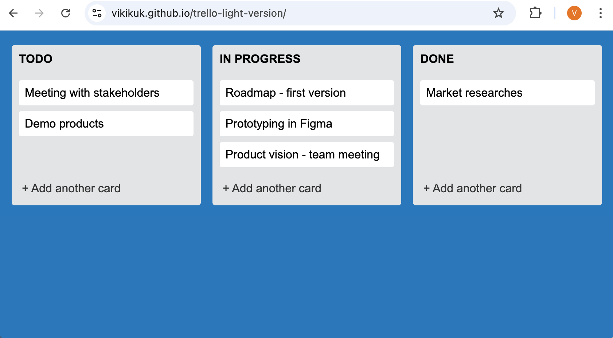

Доска доступна по адресу:  
👉 [GitHub Pages Demo](https://vikikuk.github.io/trello-light-version/)

# 🔨 Kanban-доска (light version)

**Kanban-доска** - это лёгкое приложение для управления задачами, реализующее канбан-подход к организации рабочего процесса.
Интерфейс состоит из трёх колонок этапов работы, между которыми можно перемещать карточки задач с помощью drag-and-drop. Состояние доски управляется на стороне клиента и сохраняется в LocalStorage, благодаря чему задачи и их позиции сохраняются после обновления страницы.

## Визуализация реализованного UI:

---

## 🚀 Функциональность

- перемещение карточек между колонками с помощью drag-and-drop
- динамическое создание и удаление карточек задач
- отображение placeholder во время перетаскивания
- хранение состояния доски в LocalStorage
- восстановление интерфейса из состояния после перезагрузки
- интерактивный интерфейс в стиле канбан

### Механика работы
- Добавление новой карточки:
  1. Нажать **+ Add task**
  2. Ввести текст в поле
  3. Нажать `Add` для добавления или `x` для отмены
- Удаление карточки:
  - При наведении на карточку в правом верхнем углу появляется кнопка ✕
  - По клику карточка полностью удаляется
- Перемещение карточек:
  - Можно перетаскивать карточки **внутри одной колонки** или **между колонками**
  - Курсор меняется на «кулак» во время DnD
  - Место под вставку подсвечивается placeholder’ом
  - Карточка остаётся под курсором в том месте, где была «схвачена» (не центрируется автоматически)

---

## 💾 Хранение состояния

- Всё состояние доски сохраняется в **LocalStorage**
- После обновления страницы все изменения (карточки и их позиции) сохраняются
- DOM полностью строится на основе данных из `state`

---

## 🎨 Упрощения

- Карточки содержат только текст (без картинок, меток, чек-листов)
- Нет поворота/анимации при DnD
- Нет обработки выхода карточки за пределы доски

## ⚙️ Технологии проекта

- JavaScript"
- CSS
- Webpack
- LocalStorage

